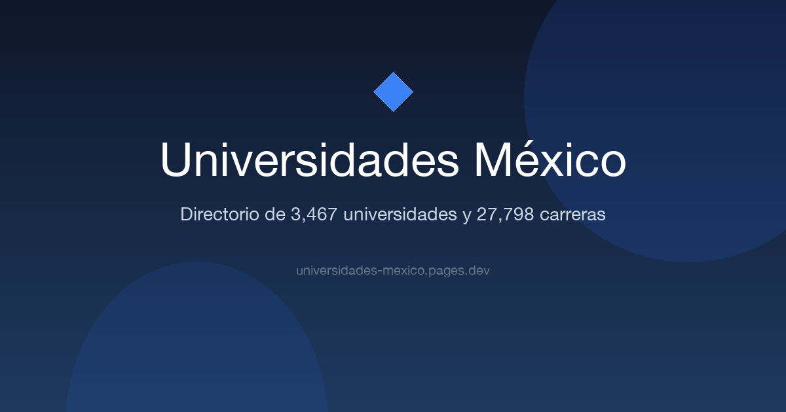
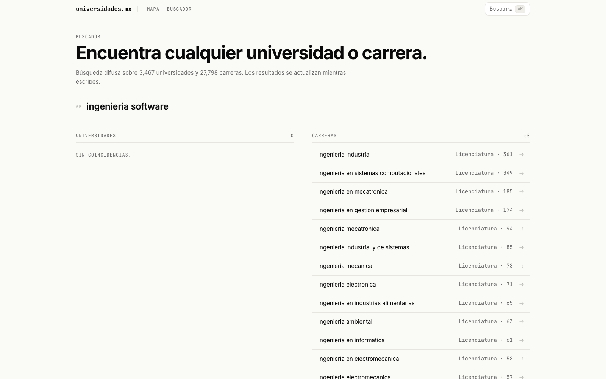
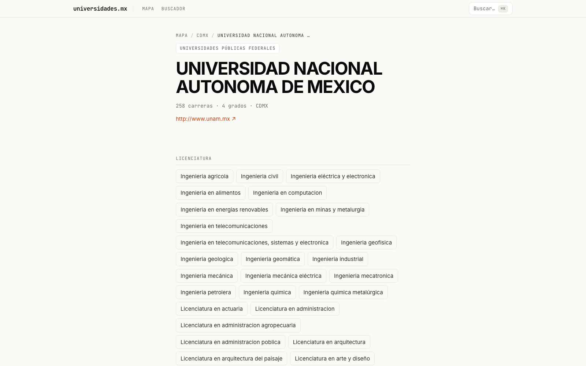
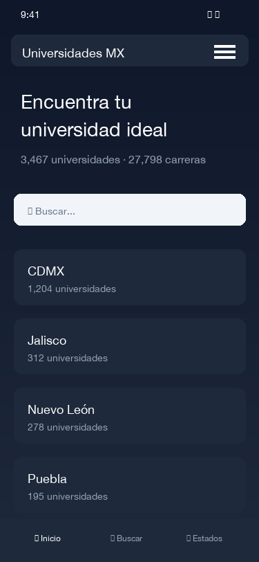

# Universidades México

🔗 **[Live Demo → https://universidades-mexico.pages.dev](https://universidades-mexico.pages.dev)**

Search across 3,467 universities and 27,798 degree programs in Mexico — blazing fast, serverless, with instant fuzzy search.



## 📸 Screenshots

### Landing page


### Search with results


### University profile


### Mobile view


## ✨ Features

- 🔍 **Instant fuzzy search** powered by Fuse.js (no server required)
- 🗺️ **Browse by state** — 33 Mexican states
- 🏫 **University profiles** with degrees, type, and location
- ⚡ **7,000+ static pages** generated in ~6 seconds
- 📱 **Fully responsive** with Tailwind CSS
- 🌐 **Global CDN** via Cloudflare Pages
- 🔒 **HTTPS enforced**

## 🛠️ Tech Stack

| Technology | Purpose |
|------------|---------|
| [Nuxt 3](https://nuxt.com) | Vue 3 framework with SSG |
| [Tailwind CSS](https://tailwindcss.com) | Utility-first CSS |
| [Fuse.js](https://fusejs.io) | Client-side fuzzy search |
| [Cloudflare Pages](https://pages.cloudflare.com) | Static hosting + CDN |

## 📊 Data

- **33** Mexican states
- **3,467** universities
- **27,798** degree programs
- Source: SEP (Secretaría de Educación Pública)

## ⚡ Performance

- **7,000+ pages** statically generated in ~6 seconds
- **Zero backend** — everything is static or client-side
- **Global CDN** via Cloudflare
- **Instant search** with Fuse.js (no server)

## 🏗️ Migration from Django

| Aspect | Before (Django) | After (Nuxt 3) |
|--------|-----------------|----------------|
| Backend | Django 1.11 + SQLite | None (SSG) |
| Frontend | jQuery + UIkit | Vue 3 + Tailwind |
| Map | CSSMap jQuery plugin (26MB sprites) | Responsive card grid |
| Search | NLTK + PostgreSQL-like | Fuse.js client-side |
| Hosting | None | Cloudflare Pages (free) |
| Deploy | Manual | `npm run generate` + `wrangler deploy` |

## 🤔 Why this stack?

I chose **SSG with Nuxt 3** because this project is purely informational: 3,467 universities and 27,798 degree programs that rarely change. Generating 7,000+ static pages eliminates server costs entirely, maximizes SEO (every university gets its own indexable URL), and allows serving from a free global CDN.

**Fuse.js** was the natural choice for search: it's lightweight (~10KB), requires no backend, and provides typo-tolerant fuzzy matching that significantly improves UX over a simple filter. Cloudflare Pages rounds out the stack with free hosting, automatic HTTPS, and global edge caching.

## 🗺️ Roadmap

- [ ] Advanced filters by field of study (medicine, engineering, law)
- [ ] Side-by-side university comparison
- [ ] State-level statistics with interactive charts

## 🧞 Commands

```bash
# Install
npm install

# Development
npm run dev

# Static generation
npm run generate

# Local preview
npm run preview

# Deploy
npm run deploy
```

## 📝 Notes

- Data was exported once from `db.sqlite3` to `public/data/universidades.json`
- The original SEP scraper is discontinued, so the data is a historical snapshot
- All university and state routes are pre-rendered for maximum SEO
